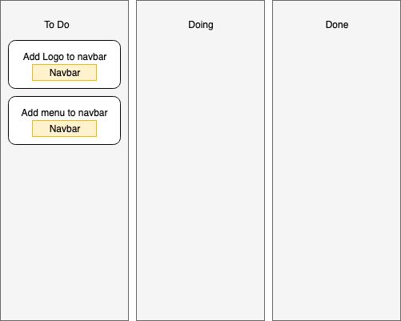

As a freelance developer, it can be hard to keep projects organized. In this post I'll talk about what Kanban is, tools you can use, and how it can help you.

I don't know about you, but starting a new project (whether paid or not) is exciting for me. I'm ready to dive right in and get to coding. While the enthusiasm is a good thing, having some organizational structures in place before touching code can make the project's roadmap clearer. This means that you're saving time and money by having a system in place. I have tried several different systems myself and have settled on kanban.

## What is Kanban?

Kanban, which is japanese for "sign", is a workflow which allows you to categorize things by their current status in the project. It was created in the 1940s by a man named Taiichi Ohno, who worked at Toyota. At the time, production and sales were down because Toyota couldn't compete with their american competitors. By utilizing this technique, he was able to increase productivity and compete with overseas rivals again.

I know what you're thinking... what does this have to do with my freelance projects? The kanban method has been used by many groups of people in many different forms since it's creation. It is commonly used in the software development world as a part of the Agile methodology. At it's most basic, it's a set of columns with "cards" or "items" in them which represent different tasks which need to be accomplished.

<Gif
  src='https://media.giphy.com/media/l0MYSqNU3hr8MUq0o/giphy.mp4'
  alt='A kanban board with cards being moved from column to column.'
/>

## What tools can you use?

There are many different tools you can use to create a manage a project in kanban. Some options are expensive and others free. Some are computer-based and others are less technical. Either way, there is likely a flavor of kanban that will meet your needs. Below are some of the options I've tried:

### 1. Post-its & Index cards

Traditionally, kanban was done with post-it notes or index cards being attached to a white board or bulletin board. This is an easy way to handle this if you're not interested in any apps to handle it for you. Plus, doing it this way gives you the satisfaction of getting up and physically moving your card when you finish working on something rather than simply clicking a button.

### 2. Trello (Free)

For a long time, I was using [Trello](https://www.trello.com) to manage my projects. It's a free tool which allows you create kanban boards with whatever columns you want and add cards. There are also a bunch of plugins that can be added to make integrations with Github, Bitbucket, Google Drive, and more possible. I would definitely recommend this tool to anyone looking for a simple kanban board tool for project management.

### 3. Notion (Free)

Recently I made the switch to [Notion](https://www.notion.so) for my project management for a few reasons. While tools like Trello offer a lot of functionality out-of-the-box, Notion allows you to create custom fields for your card in addition to lots of different content types. Notion is an app that allows you to create kanban boards along with other views for the same content. You can even create notes and other types of content that aren't even related to kanban. This was very important to me so I could keep track of business related things for projects such as invoices, meeting notes, documents sent, and more. Notion allows me to keep track of all of those things while still offering kanban functionality.

### 4. Github Issues (Free)

Github has some functionality built in with kanban to keep track of issues with a project. I've played around with this a bit but didn't enjoy it as much as I've enjoyed other tools and since I'm the only one working on my project it's not necessary to keep the board and the repo in one location. If you're interested in playing around with it, there are some tutorials [on the Github website](https://guides.github.com/features/issues/) which can guide you through the basics.

### 5. Jira (Paid)

Although there are a lot of paid services, my experience with them is limited to Jira. Made by Atlassian (the people who made Bitbucket and Confluence), it has some good things and some not-so-good things. I like the way it separates the backlog and the current sprint (assuming you're doing sprints, more on this later). Jira also offers reporting which can be very important if there are multiple developers working on the same project. For a freelancer, this may not matter. On the downside, it can be somewhat pricy for a small freelance agency or individual. In addition, it can have some weirdness in the user interface at times and it seems that things change willy-nilly which can be a bit confusing at times.

<EmailSignup title='Like this post? Join my mailing list!' />

## How do I set up a kanban board?

Once you've selected the tool you'd like to use for your kanban, setting it up is relatively simple. The first step is to figure out what statuses, or columns, you'll need. Traditionally in software development the columns are **To Do**, **Doing**, and **Done**. If testing or QA are required, there may also be a column for that in between doing and done.

### Types of cards

Once your columns are created, you can begin creating items, or cards. Each of these cards will represent a different task which needs to be performed on the site and can be as granular as you like. Cards can be created for various reasons, but some common ones are:

- **Research.** You need to research a library, method, design, etc before implementing. This card will help you remember and keep track of where you're at in that process.
- **Feature.** A feature needs to be added to the project such as a header or footer, a signup page, or a call-to-action button.
- **Bug fix.** Someone has found a bug on the site which needs to be addressed. These are usually not high impact so they aren't necessarily high priority.
- **Hot fix.** These are the issues that are affecting customers and ultimately the bottom line. Hot fixes are things that need to be addressed immediately and should be at the top of the column.

### Labelling cards

Cards will typically have a title and description for details about the task, but you can also typically add a label, or epic as they're sometimes called. This is a way of grouping cards together if they are focusing on related items. An example could be as follows:

Cards can have as many or as few labels as you'd like, depending on your organizational structure. Typically I just give them one label which relates to the overal goal I'm trying to achieve. If you're using an application to do this, you can often filter by label as well making it easy to see the status of everything relating to that goal. This ability can greatly help when it comes to finishing projects on time.

### Establishing card priority

A part of organization in the kanban board has to do with priority. This is important so you can make sure you're completing the most impactful and important work first. Keeping track of priority is as simple as moving it up-and down the column. The closer to the top the card is, the higher the priority. Having this ability means you can focus on the priorities rather than just working your way down the list and getting to them when you get to them.

## Sprints & Backlog

The next item I'm going to talk about isn't explicitly kanban, but it goes hand-in-hand with it when using the Agile and Scrum methodologies. Although this may not apply to you, I'll explain them anyway so if it ever comes up you're not completely lost.

### What is a sprint?

A sprint is a set period of time to work on a set of given cards. This is an established timeframe, usually betwen 1 and 4 weeks. During this period, there should be regular communications between anyone working on the project to make sure issues are getting resolved as efficiently as possible. At the end of the sprint, new cards are assigned and a new sprint begins.

In addition, at the end of each sprint there should be a "retrospective" where all people involved meet and review the previous sprint to determine what worked well and what could have been improved. There should also be a "backlog refinement" meeting which we will cover next.

### Backlog refinement?

Before I talk about backlog refinement, I should explain what a backlog is. Depending on the tool you're using for the project, you may or may not have access to a "backlog". The backlog represents all cards that don't have a status yet. In an agile or scrum setting, at the beginning of sprint cards are assigned to a developer which go into his (or her) To Do column. Any cards that have yet to be worked on and aren't in a developer's To Do column are considered backlog.

A backlog refinement is a meeting where everyone involved with the project meets and goes over the backlog. Each card is reviewed and modified if needed and then assigned to a developer. These meetings can help give more information about an upcoming card, address cards that may have been fixed as a result of another change, or even add new cards as things are being talked through.

### Final thoughts on Sprints & Backlog

As a freelancer, I really don't use sprints. It's still a part-time job for me so I'm generally working on cards when I have time and projects don't last long enough to teach these methodologies to a client. I generally stick with kanban and backlog, although backlog is more because I don't like seeing a 100 card long to-do list. That's just personal preference though.

In a larger team environment or at an enterprise company, I would definitely recommend using something like Agile or Scrum to organize the project. Not only does it make things simple to assign to people, it encourages communication and efficiency. Typically as a team works together for a long time, communication gets very fluid and effective.

<Gif
  src='https://media.giphy.com/media/l0HlQngl0Eja36dlS/giphy.mp4'
  alt='That looks extremely promising!'
/>

## Conclusion

While there are many different ways to organize your projects as a freelance developer, I recommend giving kanban a try. It is a very flexible framework for project management and can adapt to whatever you need it to be. Some people (myself included) have even started <a href="https://www.google.com/search?q=dungeons+and+dragons+agile" target="_blank" rel="noopener">using it for things like Dungeons & Dragons</a>. The applications for kanban are virtually limitless and I encourage you to see what you can apply it to in your life!

Have a question or want to share your thoughts? You can find me on Twitter [@iam_timsmith](https://www.twitter.com/iam_timsmith).
