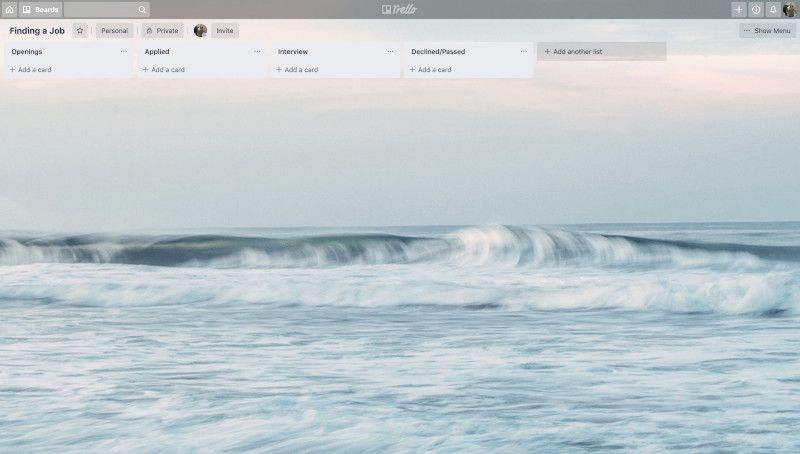
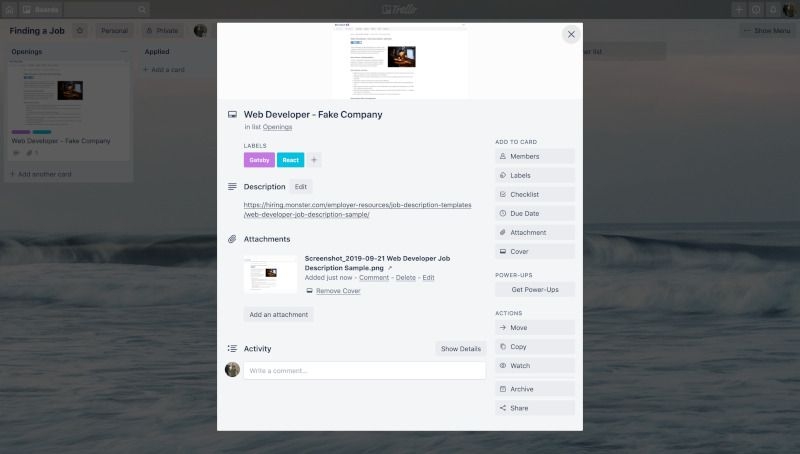

Finding a job in the web development industry can be pretty hard. Using a kanban workflow during the application process can help keep you organized and efficient.

In the programming field, there are lots of jobs available on a local and global level. Finding a job may mean competing with other developers who live in the same town as well as developers who live halfway across the world. Because of the large number of applicants competing for each job, it's imperative to streamline your processes as much as possible.

I discussed in a previous blog post what kanban is and how it can be applied to projects in a freelance setting. In this post I'll be discussing some of my ideas about how it can be used to make the process of finding a job much easier.

<Gif
  src='https://media.giphy.com/media/r056JQBFkE8QE/giphy.mp4'
  alt='"Are you ready for this jelly?" - Moss, I.T. Crowd'
/>

## What tools can be used for a kanban workflow?

While not all tools will be able to fit your needs when finding a job, there are some that will work very well for this application (pun intended). Below are just a few options from which you can choose:

### Index cards & post-it notes

When it comes to applying for jobs, I have to admit that this is my least favorite way to manage a kanban board. The biggest reasons for this are the inability to add attachments and the lack of copy/paste. Sure you could just print out the attachments you want and tape them to the card/sticky, but that would get messy really quick and use SO MUCH paper.

### Trello

Trello is a good choice for managing kanban board. Especially since it has different types of integrations such as Google Drive. These integrations make adding your resume, cover letter, or any other documents to a card without any extra effort. Plus you can set a nice background for your board to inspire you or maybe help remind you of what your goals are and why you want a new job.

### Notion

My preferred tool for using this workflow is Notion. There are a few functionalities that Notion offers which makes things easy. The first is the ability to switch between a list view and a board view. Having this ability makes it easy to add new job listings and filter out your applications by where they are in the process. In addition, Notion allows you to create various types of content which can be used to act as a reference when applying to jobs.

## How to set up your board for finding a job

Setting up the board should be relatively simple, regardless of which tool you choose. The number of columns your board has is really up to you, but at a minimum I'd have the columns pictured below:

<EmailSignup title='Like this post? Join my mailing list!' />

## Kanban board setup for finding a job

I'll break these columns down for you and you can add or remove any that aren't necessary for your purposes.

### Openings

This column functions the same as the to-do column normally would. When finding a job, this column should be a list of job openings for which you'd like to apply. This can come in handy if you are on a mobile device and find a job listing you like but don't have the tools, documents, or time to apply right now. Adding a card into this column can act as both a reminder and a way to find that job posting again when you do have the resources necessary to apply.

### Applied

Although I'm sure you've already guessed what this column is for, this is where you will put your cards once you have submitted your resume and cover letter. When using a kanban tool such as Trello or Notion, a log is kept of when cards are moved around, so moving the card to the Applied column after applying gives you a nice reference when trying to figure out when to send a follow-up email or call.

### Interview

A card would be moved to the interview column if the prospective employer called you in for an interview. It is possible that a card will not make it into this column and will instead go to the Declined/Passed column.

> Please note: This is perfectly okay. Don't be discouraged if your interview column isn't stacking up. Finding a job takes time. The purpose of this column to track various applications and where they are in the process, not a reflection of your worth.

### Declined/Passed

This column can act as a done column in terms of normal kanban setups. This is where your cards will go if you decline the position because it wasn't a good fit, you haven't heard from the prospective employer in 3-4 weeks or more, or if you receive a notification that you aren't moving forward. If seeing this list upsets you, you can archive the cards or hide them if you're using Notion. By doing this, you still have a record but it won't bring you down.

## What should go into the cards?

Good question! The content for the cards was actually a big part of the reason for developing this workflow. It got to be a real pain when doing interviews weeks after I'd applied and I couldn't remember what my cover letter said, so I couldn't refer back to it. It was also a hassle when I'd try to look at the job posting for a refresher before an interview and it had been taken down.

I'll break down what should be happening with a card as it travels through each column. As before, this is how I have done it in the past. If you have more information you'd like to add or if this is too much for your needs, feel free to change it to fit your needs.

### When the card is in the Openings column

Cards should start in the Openings column since this will act as a list of jobs for which you'd like to apply. When creating your card, I recommend naming the card the job title followed by the prospective employer, such as Web Developer - Fake company. In addition, you can use labels to highlight skills required for the job. That way it's easy to get an idea of what the job is looking for without digging through the job descriptions. It can also help to highlight what type of jobs you're finding which may help to improve your job searches.

To prevent the issue I mentioned earlier with the job listing being removed, I also recommend you screenshot the listing and upload it to the card. It may also be helpful to include a link to the job listing if you need to refer back to it (assuming it hasn't been taken down).

What your card should look like in the Opening column:

### When the card is in the Applied column

The card should be moved to the applied column once you have submitted your cover letter and resume. When moving the card over, I like to attach a copy of the resume and cover letter for any time I may need to reference it in the future. I have found that being able to reference these documents when preparing for an interview. This brings me to the next column: Interviewing.

### After you've gotten the interview

If you receive an email, letter, or phone call asking you for an interview, congrats! You get to move the card to the next column! At the very least, I'd put the date and time for your interview as part of the note or as a comment. It can also be helpful to take notes during an interview which can also be added to the card. Having your notes in an easy-to-find place can make for an easy resource if you took notes about the company or even to refer back to before a second or third interview.

### The Declined/Passed column

Cards should be moved to the Declined/Passed column when either you decide a job isn't a good fit, a prospective employer hasn't gotten back to you in 3-4 weeks, or if you have heard back and they decided to pass on you as a candidate. Because of this, there's not much you need to add to the card when moving it to this column. If you decided the job wasn't a good fit, it may be a good idea to include the reasons you decided the job wasn't right.

### Additional columns you could include

There are some other columns you could use in your kanban board. In the past, I've used columns such as Follow Up and Thank You to help keep track of which jobs I've replied to. You could also add a column for each set of interviews you've gone for. If there's any other columns you could think of that would be beneficial, I encourage you to add them. This process can evolve as you find out what does and doesn't work for you.

## Wrapping Up

There are a lot of ways to stay organized while finding a job. This is the one that has worked best for me in the past and I recommend giving a try. It makes it easy to tell where each application is in your "job funnel". Having everything in one spot makes things very easy to keep track of when prepping for an interview or trying to remember why you did something.

Have thoughts or questions? Feel free to reach out to me on Twitter @iam_timsmith.
