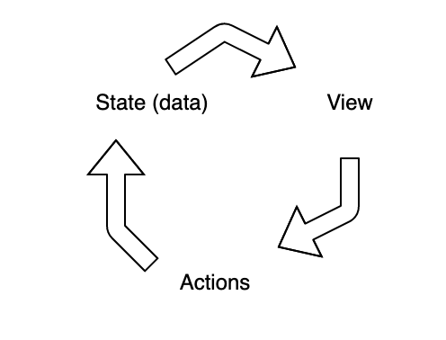

React is one of the most in demand tools in the job market these days, but if you don't know it should you just skip it? You could, but I still think it's worth learning. I'm going to teach you some basics about react to get you started. This should be enough information to give you an understanding of what React is and how to set it up.

## What is React?

[React is a JavaScript library](https://reactjs.org/) built by [Facebook](https://www.facebook.com) which creates a virtual DOM and allows a website or web application to update (or react) based on changes in data. It has been growing in popularity since it's release in 2016, even overthrowing jQuery as the most in-demand JavaScript skill, a title which jQuery had held for about a decade.

### Why is React useful?

Part of the reason for the popularity has to do with the direction of data flow in a React application. In the past, a webpage would load the static HTML, then load the JavaScript to make changes to the page as needed. If that involved updating any data on the page, there would be a "flicker" where you'd see the original content before it was updated via JavaScript.

React was a gamechanger because it modified the paradigm to be data-driven. In a React application, the state (data) is passed into the view (HTML). When the view is changed or interacted with, an action is called which updates the state and re-renders the view with the new data. This is called unidirectional flow and can be very helpful.

<Gif
	src='https://media.giphy.com/media/26DMX0rWhOZhYsu6k/giphy.mp4'
	alt='This has all been very helpful. Thank you.'
	width={300}
/>

## How to set up a React project

When React first came out, setting up a project was a headache. There weren't any tools or starter projects out there to get things up-and-running very quickly so things like Webpack had to be configured manually each time. Since then, several projects have come out which make setting up a React project a piece of cake. The items I discuss below are not an exhaustive list by any means, but they are some of the more popular options. Before we get into tooling, lets go over some basics so you understand how the application interacts with the HTML on the page.

### Creating an instance of React
I have written a post about [setting up a React project using Parcel](/blog/lets-build-a-search-bar-using-react-hooks) as a bundler which can give a more detailed walkthrough about getting a React application up and running from scratch. There are multiple ways to do this but some of the more common build tools include [Webpack](https://webpack.js.org/), [Parcel](https://parceljs.org/), and [Snowpack](https://www.snowpack.dev/).

### Create-React-App
Back when I first started learning React, there was a lot of talk about the difficulty in figuring out how to configure webpack. This was not only complicated but time consuming each time a new project started. The community felt this pain and decided to do something about it. The result is `create-react-app` (or CRA), a starter which bootstraps a project with a minimal structure.

Creating a new project with this library is as easy as running the command `npx create-react-app new-app`. Just like that, it will create a new directory called `new-app` (or whatever value you pass in) with a rudimentary structure as well as a configuration built to work on a React project without any assumptions about which tools will be used.

### Using Next.js for a project
An alternative to Create React App is [Next (or Next.js)](https://nextjs.org/). Unlike CRA, Next is an opinionated framework which offers build tools, routing, server-side rendering, and static site generation out-of-the-box. This is a popular option which is used by companies like Nike, TikTok, Netflix Jobs, Twitch.

Originally, Next was created for server-side rendering which means that all of the code is built on the backend and sent to the client which then renders it. Create React App doesn't offer this ability which may or may not be a big deal for your project. The primary benefit to server-side rendering, or SSR, is that it's really easy for SEO crawlers to get the content on your site since it's all being sent from the server instead of being built in the browser after the user visits the url. If you're building a web app where SEO isn't a concern, then you likely won't have to worry about SSR.

### Using Gatsby for a project
Another popular solution (and the one I've used for 4 years at the time of this post) is Gatsby. I've written [several posts about Gatsby](/blog/how-to-build-a-blog-with-wordpress-and-gatsby-part-1) as well as [how to improve the default SEO component](/blog/creating-a-better-seo-component-for-gatsby) which comes with a default Gatsby project. Needless to say, I'm a big fan.

So, what is Gatsby? I'm glad you asked. Gatsby is a Static Site Generator, or SSG, which means that you can create a site using React components and then build the site which creates static HTML pages from your React components. This means that sites are *blazing fast* when the browser renders a page because it doesn't have the extra bloat that comes along with tons of libraries which block rendering or slow down performance.

In addition to being crazy fast, Gatsby offers routing, graphql, and optimized images without any customization. Plus, if you do need something special added on like a CMS or other tool, [Gatsby offers tons of plugins](https://www.gatsbyjs.com/plugins) to assist with this. SSG also adds SEO benefits since the code is being compiled into HTML, so there's not much difference between Next and Gatsby in that regard.

### Which should I choose?
As I mentioned before, you should use Create React App when SSR and SEO are not a concern (webapps, admin panels, cms, etc). Choosing between Next and Gatsby is a bit more complex since both offer SSR and SSG nowadays. Choosing which is right for your project really depends on whether you're looking for server-side rendering or static site generation and which one you prefer. Performance differences are neglegible and both support TypeScript, testing, other features.

<Gif
	src='https://media.giphy.com/media/26FPIGF8y0GmUBruU/giphy.mp4'
	alt='Choosing a framework can be as difficult as choosing your starter pokemon!'
/>

The big difference between server-side rendering and static site generation is that SSR collects data each time the page is fetched and renders whatever is collected while SSG collects data at build time and builds static files from that data. For example, if you were using a CMS for content management and SSR on the frontend, you could simply refresh the page after updating a blog post and see the updates. If you were using a CMS and updated the same blog post, you wouldn't see updates in a statically generated site until ran another build so it could pull in the updated data.

## What are some features of React?
React has become one of (if not THE) most in demand front end library for good reason. It offers features which make front ends data-driven and reactive. I will cover some of these benefits below so you can decide if React is the right tool for the project you're looking to build.

### Unidirectional data flow
A unidirectional data flow means that data only flows one way. This is important because other frameworks and libraries allow data to be cchanged from both the front and back ends which can get hairy to troubleshoot. So how does unidirectional data flow work? First, the state, or data, is passed to the view and it's children. The view can then call actions if data needs to be updated. Once the action is called, it updates the state which then causes the view to re-render. This may sound confusing, but I have placed a diagram below to help illustrate how this is unidirectional.



### State management
Because of the unidirectional flow, React provides a state management system. This is a way for your application to track the data being used and re-render your components when that data is updated. I have written a blog post about [state management in class components](/blog/this-state-how-to-use-state-in-react/) and also about [building a search bar using state with the new hooks system](/blog/lets-build-a-search-bar-using-react-hooks/).

The state can be managed within an individual component or passed around wherever it's needed, making the site really reactive to data changes. There are also tools which make it easy to share state all around the app without having to pass it from component to component to component, but we'll go over those more later.

### Component structure
Another feature of React is the ability to build reusable components for your project. This is a really cool feature because you can write a chunk of code and drop it in wherever you want it (even with unique data each time!) without having to rewrite the same code in each spot.

Each component can also accept props, or variable data which can then be used to render data in the component. By using props, you can build out the basic structure of a component without any actual hard-coded text or images and pass props in to make those things dynamic each time you use the component.

I have written a [blog post about creating components using the class component](/blog/class-components-vs-stateless-functional-components/) structure and will soon write one about writing functional components using hooks for state and lifecycle methods.

<EmailSignup title='Like this post? Join my mailing list!' />

## The React ecosystem
One of the more complicated things to learn is the ecosystem around React. Since it is such a popular tool, there are LOTS of different libraries which can be used to do a variety of things. Below I will talk about some of the libraries used for common challenges when building a React application.

### Required libraries
When using React for a project, there are two libraries that are required to make it work: `react` and `react-dom`. You can install both in your application by running the command:

```bash
npm i react react-dom
```

[React](https://www.npmjs.com/package/react) is a library which contains the code needed for state management and component creation. [React DOM](https://www.npmjs.com/package/react-dom) is the library specific to web development which allows the use of DOM elements (such as `div`, `h1`, or `p`) in your components. With these two libraries, you can start building out a React project.

<Gif
	src='https://media.giphy.com/media/GxMOE1Ns0fdy4bfhf6/giphy.mp4'
	alt='So long, binder of requirements!'
/>

Of the solutions I mentioned earlier, Gatsby and Create React App both come with these already installed. When setting up a Next application, these libraries need to be installed alongside the Next library.

### Other popular libraries
Aside from the required libraries, there are a lot of libraries to choose from. These are all optional, so it's worth looking into each one for your needs and seeing which one works best for your project and preferences.

#### State Management
React contains a state management system called [Context](https://reactjs.org/docs/context.html) which allows [state to be managed on a global scale and used where it's needed](/blog/how-to-use-react-context). This comes built in and doesn't require any other libraries to be installed, but I thought it was worth mentioning here because it's a viable solution out-of-the-box.

Another really popular library for global state management is called [Redux](https://redux.js.org/). This is a very widely used library and uses actions, reducers, and stores to handle state. In short, a component calls an action which is then analyzed by the reducer to decide how to update state. There can be more to this method such as sagas and thunks but in it's most basic form, this is an overview of how it works.

#### Routing
While libraries like Next and Gatsby have routing built-in, Create React App does not so you may need to set it up yourself. The most popular library for this is [React Router](https://reactrouter.com/). Another popular option in the past was called [Reach Router](https://reach.tech/router/), but the two have become merged as of version 6.

These libraries allow you to establish a path to use in the url and a component to render when that path is visited. For what it's worth, under the hood Gatsby uses Reach Router while Next uses it's own file-system based router.

#### Testing
Along with React, Facebook developed a tool for testing JavaScript called [Jest](https://jestjs.io/). When used by itself, Jest is primary good for testing logic. It doesn't handle any sort of DOM rendering or snapshot testing, so another library is needed for that. The two most commonly used tools for DOM testing are [Enzyme](https://enzymejs.github.io/enzyme/) and [React Testing Library](https://testing-library.com/docs/react-testing-library/intro/). They both do pretty much the same thing, so it's really just a matter of preference. For end-to-end testing, the most commonly used library is [Cypress](https://www.cypress.io/).

#### Styles
In addition to [normal css](/blog/using-variables-in-css), there are [different tools which can be used for styling](/blog/how-to-use-styles-in-a-react-js-application/) in your React applications. [Styled Components](https://styled-components.com/) is a popular option and allows you to write your styles directly in your JavaScript code. [Sass](https://sass-lang.com/) is another commonly used option which has many benefits of css with some "special sauce" on top. Of course, you can also use tools such as Bootstrap, Material UI, etc.

## Conclusion
As you can see, React has a lot to offer when building front-end applications. It is one of the most in-demand skills for a developer seeking a job. There is a huge community and as a result tons of options when building out a project.
